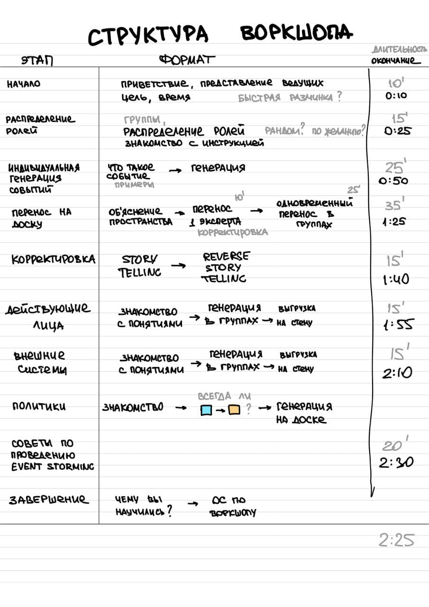

# Фасилитационный план воркшоп по Event Storming

## Формат
* Количество участников: до 30 человек
* Время: 2,5 часа 

## Структура

### 1. Начало (10'/10')
* Приветствие участников
* Представление ведущих
* Цель воркшопа
  * Познакомиться с техникой Event Storming
  * Event Storming – это воркшоп, во время которого люди, у которых есть вопросы, (обычно это разработчики) встречаются с людьми, у которых есть ответы (обычно стейкхолдеры), чтобы составить целостное описание домена через события, определить границы контекстов и выделить агрегаты
* Время 2,5 часа
* Примерное расписание

### Распределение ролей (15'/25')
* Формируем группы по 3-5 человек
* В каждой группе будет 1 доменный эксперт и несколько разработчиков
* Выберите себе роль
  * По желанию
    * Просим подойти доменных экспертов к одному ведущему, разработчиков — к другому
    * Раздаем им конверты с инструкциями
  * Или рандомом. Например на столе лежат конверты с ролями, участники выбирают себе конверт
* Ознакомьтесь с инструкцией
  * Не показывайте вашу инструкцию другим участникам

### Индивидуальная генерация событий (25'/50')
* Что такое событие? Рассказываем на флипе с примерами событий. (10')
* Просим участников взять оранжевые стикеры и выписать все события обсуждаемой предметной области, которые приходят им на ум - по 1 событию на 1 стикере. Задание индивидуальное: каждый работает со своими стикерами. Заводим таймер на 5 минут - достаточно для генерации значимых событий. (7')

### Совместный перенос событий (10'/60')
* Рассказываем про стену (3')
  * Шкала времени слева направо
  * Огромное пространство
  * Начинайте с середины
  * Не лепите стикеры вплотную
* Перенос на стену экспертом (5-7')
  * Просим доменного эксперта выбрать 3 события из начала, середины и конца процесса и повесьте на стену в хронологическом порядке. Один стикер должен оказаться у левой границы стены, второй в середине, и третий - у правой границы стены.
  * Ведущий верифицирует размещённые на стене события. Корректирует формулировку, если требуется.
  * Если на стикерах встречаются термины, то ведущий заносит их на флипчарт "словарь терминов"

### Перенос стикеров в группах (25'/85')
* Разбиваемся на группы по 5-6 человек. Возможно, стоит напечатать задание на разноцветных листах, чтобы потом можно было быстро разбиться на группы по цвету задания
* Ведущий объясняет правила. Сейчас каждая группа должна приступить к переносу стикеров на стену. Переносим по 1 стикеру за раз. Автор зачитывает стикер и клеит на нужное место. Группа смотрит, нет ли у них стикеров-дубликатов, а также помогает автору скорректировать формулировку. Группа заносит термины в словарь, если они возникают
* Ведущий открывает на легенде фиолетовые стикеры - hot spot. Объясняет, как использовать этот стикер. Призывает участников использовать его в случае, если при переносе стикеров в группе они сталкиваются со стикерами, размещёнными другой группой, вызывающими вопросы.
* Ведущий заводит таймер на 15 минут и стартует перенос стикеров в группах
* Во время работы групп ведущий активно сопровождает процесс:
  * Громко напоминает, что осталось 10 минут, 5 минут, 2 минуты
  * Смотрит на размещаемые стикеры и поворачивает на 45 градусов те, у которых неудачная формулировка
  * Размещает hot spot-ы с вопросами и подсветкой важности некоторых событий (имитирует действие доменного эксперта). Например, возле события "клиент вернул кота" можно разместить hot spot с текстом "Возвращают блохастых котов - нельзя их выставлять в зал!!!"
  * Клеит горизонтальные полосы малярного скотча, чтобы разделить параллельные процессы

### Обзор и корректировка (15'/100')
* Ведущий самостоятельно показывает, как применять story telling и reverse story telling для корректировки. Участники могут очень много времени на это потратить, поэтому лучше отдать это ведущему. 
* Story telling - это зачитывание стикеров слева направо таким образом, чтобы получилось похоже на рассказ истории. Если выходит нескладно, значит мы пропустили какие-то события, и нужно их тут же приклеить. 
* Reverse story telling - это чтение справа налево. После зачитывания стикера задаём вопрос: "А что было перед этим? А что должно было произойти, чтобы случилось это?"

### Генерация действующих лиц в группах (15'/115')
* Ведущий открывает в легенде новый вид стикеров - жёлтый, действующее лицо. 
  * Объясняет, что это роль, которую выполняет человек. 
  * Действия человека приводят непосредственно к событию каким-то образом: заполнил форму и отправил её, позвонил, написал в чат, нажал на кнопку, обратился на кассе - неважно.
  * Действующее лицо клеится слева от события.
* Ведущий просит снова разбиться на те же группы и разместить как можно больше действующих лиц на стену за 10 минут - заводит таймер
* Во время работы групп ведущий активно сопровождает их, отвячая на вопросы и корректируя стикеры

### Генерация внешних систем (15'/130')
* Ведущий открывает в легенде новый вид стикеров - розовый, внешняя система
  * Объясняет, что это либо система, либо другая команда/отдел в компании, либо стороняя организация, к которой мы обращаемся за какой-либо услугой или которая предоставляет нам какие-либо сведения. 
  * Для нас внешняя система - это чёрный ящик, и знание его внутренностей нам не интересно. Главное, что на входе мы просим что-то сделать, а на выходе внешняя система генерирует событие: "Дело сделано". 
  * Например, если клиент оплатил товар через Apple Pay, то это банк нам сообщит о том, что оплата проведена. Нам неважно, как устроен банк, но важно, что от этой внешней системы мы получаем это событие, после которого мы можем спокойно передать кота клиенту. 
  * Внешняя система всегда находится слева от события, которое она порождает
* Ведущий просит снова разбиться на те же группы и разместить внешние системы на стену за 10 минут - заводит таймер
* Во время работы групп ведущий активно сопровождает их, отвячая на вопросы и корректируя стикеры

### Подведение итогов big picture
* Ведущий объявляет окончание первого из трёх этапов Event Storming - построение big picture
* У нас ещё не выстроились бизнес процессы, и далеко до архитектуры, но
  * Мы уже охватили всё, что происходит в бизнесе, и каждый участник этот бизнес понимает, видит общую картину. Заметьте - никаких многочасовых демо, макетов интерфейсов, презентаций с кучей вопросов и непонимая на выходе. Мы общаемся на языке стикеров, лаконично и эффективно.

---

### Команды, действующие лица, модели для чтения, системы (35')
* Знакомим с понятиями
  * Команда
  * Действующие лица
  * Модель для чтения
  * Система
  * Вопросы, замечания, проблемы
* Сгенерируйте недостающие элементы и добавьте их на стену

### Политики (20')
* Что такое политики?
  * Действующие правила
  * Как наша система реагирует на события?
  * Явные политики: известные всем правила
  * Неявные политики: у нас так принято
  * То, что можно автоматизировать
* Сгенерируйте политики

### Агрегаты (15')
* Что такое агрегат
  * Стейт машина
  * Система, которой еще нет
  * Обрабатывает схожие команды
  * Генерирует схожие события
* Как называть агрегаты
  * Не думайте об этом
  * Называйте как угодно: бурбулятор, корпускулятор, сортировщик, завсклад
* Найдите агрегаты

### Советы по проведению Event Storming (15')

* Полезные материалы для проведения, чеклисты

### Завершение (10')
* Чему вы научились?
  * Напишите на стикере и повесьте на флип
* Оцените воркшоп 
  * Огнище-говнище
  * Что нам удалось?
  * Что можно улучшить в следующий раз

## Флипы
1. Расписание
2. Событие
3. Команда
4. Действующие лица
5. Модель для чтения
6. Система
7. Вопросы, проблемы, идеи, замечания
8. Политика
9. Советы по проведению
10. Чему вы научились?
11. Оценка воркшопа

## Вопросы
* Можем ли мы воткнуть куда-нибудь что делать дальше?

## Список того, что нам нужно
1. Длинная стена или рулон
2. Стикеры. Много, разных цветов и размеров. Оранжевые, желтые, зеленые, голубые, розовые, фиолетовые. Квадратные и прямоугольные. Большие и маленькие.
3. Sharpie для всех участников
4. Флипы 20 шт
5. Маркеры Neuland для флипов. 4 outlender, несколько разных цветов
6. Точки для голосования
7. Малярный скотч
8. Конверты 30 шт
9. Рапечатанные роли 30 шт, разные
10. 

## ToDo List
- [x] Отправить требования огранизаторам
- [x] Заревьювить структуру
- [x] Разбить доменных экспертов
- [ ] Прогнать самим с начала до конца
- [ ] Саша: Сформулировать цель Event Storming: зачем, какую проблему решаем, что получаем на выходе
- [ ] Подготовить список ресурсов
- [ ] Саша: Добавить материалы (чеклисты) в github
- [ ] Саша: Посмотреть и переделать таймлайн
- [ ] Подготовить примеры событий / команд для флипов
